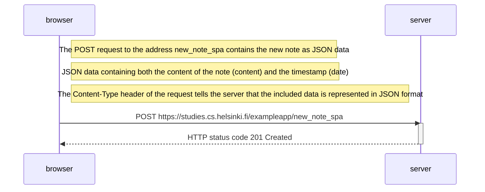

# Forms and HTTP POST Mermaid Diagram

```mermaid
sequenceDiagram
    participant browser
    participant server

    Note right of browser: The POST request to the address new_note_spa contains the new note as JSON data
    Note right of browser: JSON data containing both the content of the note (content) and the timestamp (date)
    Note right of browser: The Content-Type header of the request tells the server that the included data is represented in JSON format

    browser->>server: POST https://studies.cs.helsinki.fi/exampleapp/new_note_spa
    activate server
    server-->>browser: HTTP status code 201 Created
    deactivate server

```
